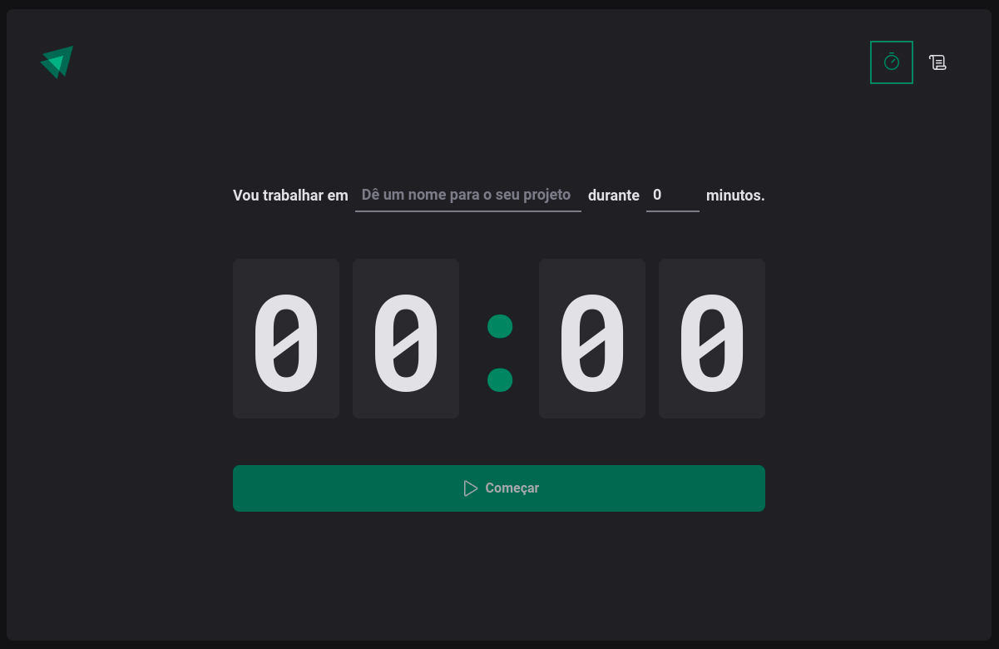

# Ignite Timer

## Tecnologias Aprendidas

Neste projeto, eu pude aprender e aplicar as seguintes tecnologias e conceitos:

- Roteamento no React
- Renderizações no React e fluxo do `useEffect`
- Gerenciamento de estados via Contextos do React e Reducers
- Manipulação imutável de estados com `immer`
- Estilização via CSS-in-JS
- Criação e validação de formulários no React

## Imagens do Projeto

